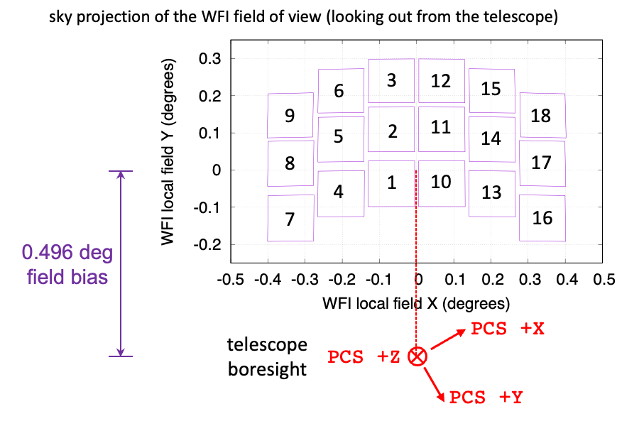
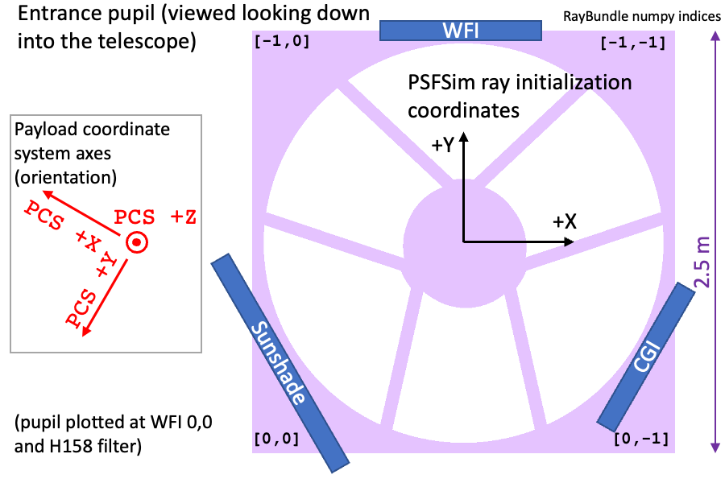
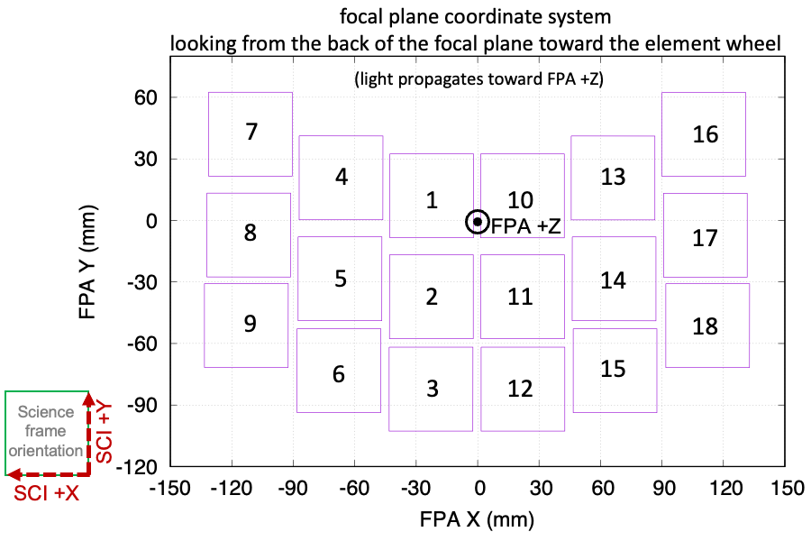
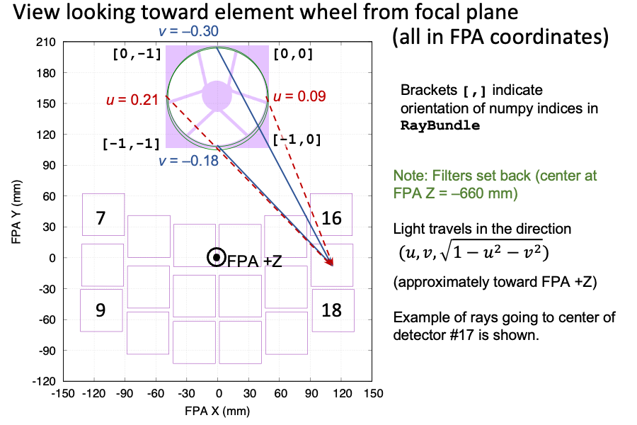

Coordinate Systems and All That
###############################

There are several coordinate systems in use in the Roman project and data processing, and it can be hard to keep track of everything! This page describes the choices in ``PSFSim``.

Relevant coordinate systems used elsewhere
==========================================

The **payload coordinate system** (PCS) is the fundamental 3D coordinate system used in the optical model in ``PSFSim``. It is a right-handed system with:

- The +Z axis points along the telescope boresight.
- The +Y axis points from the telescope axis toward the WFI radiator.
- The sunshade is in the direction of (-1/2) Xhat + (-√3/2) Yhat.

The **focal plane array coordinate system** (FPA) is a 3D coordinate system used to describe rays incident on the detectors in ``PSFSim``. It is a right-handed system with:

- The origin is on the nominal focal plane, between detectors 1 and 10.
- The +Z axis is pointed perpendicular to the focal plane, in the direction the light is traveling (so *away* from the exit pupil).
- The +X axis is the "long" axis of the focal plane, pointed toward detectors 16--18.
- The +Y axis is the "short" axis of the focal plane, pointed toward detectors 7 and 16.

The **WFI local coordinate system** is used to describe field positions on the celestial sphere(XAN, YAN). It is an angular system, mapped to 2D coordinates via the Azimuthal Equidistant Projection.

- This system is centered at the center of the WFI field of view. This is biased 0.496 degrees from the telescope boresight, since the WFI uses a portion of the "annulus" that gets corrected in a three-mirror telescope.
- The WFI local +X direction is the direction on the sky that maps to FPA +X in the image plane. However, WFI local +Y maps to FPA -Y in the image plane, so beware.

From the sky to the telescope
=============================

The relation between the WFI to the PCS is as follows (looking out at the sky):

Note that PCS +Z points along the telescope boresight.

Rays entering the telescope are initialized at an entrance plane (this diagram is looking "down" into the telescope): 

  
The rays are stored internally in ``PSFSim`` in a ray bundle, which is a 2D grid of rays. The entrance pupil diagram is shown in the same orientation as displaying the ray bundle in ``ds9`` (the ``[0,0]`` ray is initialized in the lower-left, closest to the sunshade, while ``[-1,0]`` is closer to the WFI and ``[0,-1]`` is closer to the CGI).
  
Ray geometry incident on the focal plane
========================================

The layout of the focal plane coordinate system is:

Note that the FPA +Z axis is coming toward the viewer. The "science frame" of each detector defined by the SOC is flipped from the FPA coordinates so that it has the same parity as one would see looking at the sky. The science frame +Y is in the same direction as FPA +Y, but science frame +X is in the direction of FPA -X.

We can also zoom out and look at the path from the filter to the focal plane:

Here the filter is ≈ 660 mm "behind" the plane of the figure, with light rays coming out toward the viewer. We label the numpy indices of the rays to show the orientation of the ray bundle.

We also show the direction cosines (u, v) for the light ray in the FPA coordinate system. Note that (for example) the ray coming *from* the top of the exit pupil (in the diagram) has the *most negative* value of v, because it is tilted the farthest in the FPA -Y direction in order to converge to the same point on the detector.
